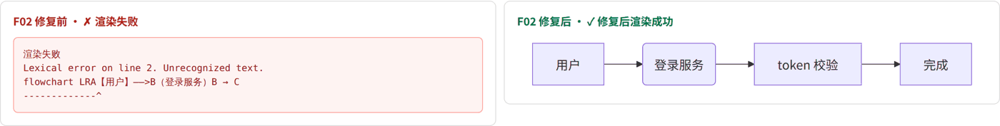
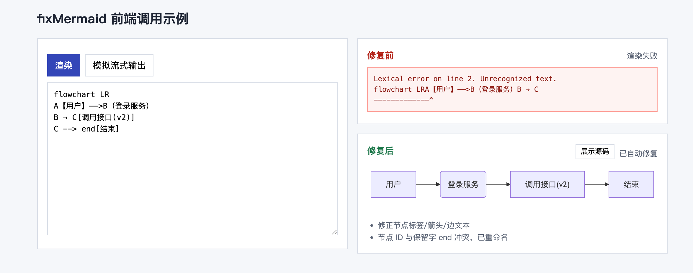
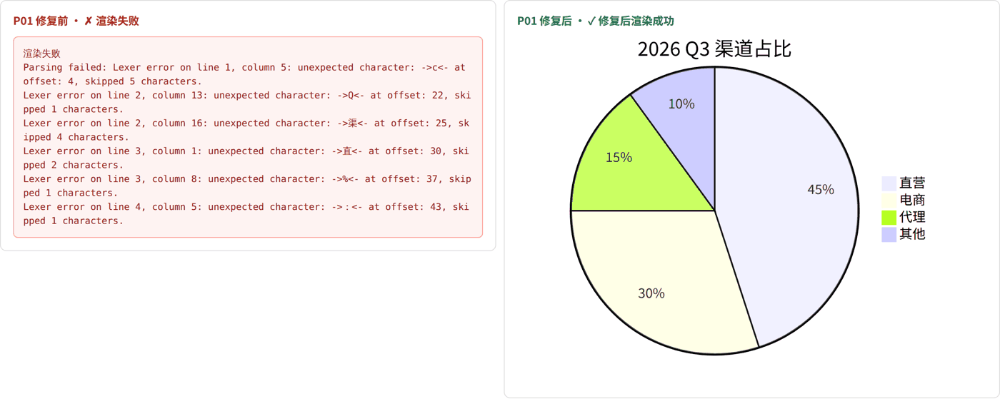
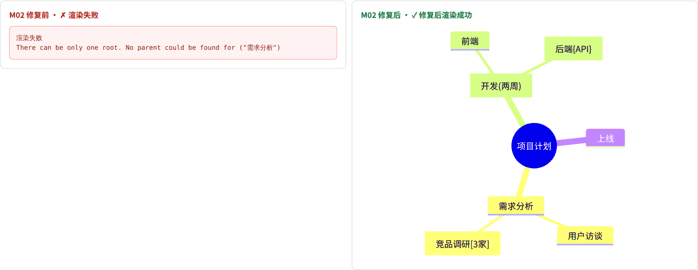
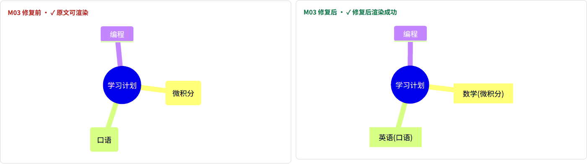
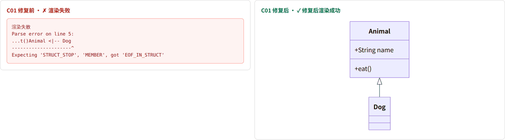
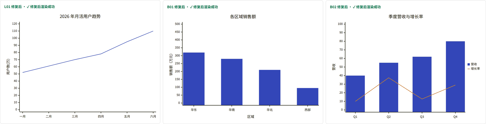

# fix-mermaid

**Repair Mermaid syntax errors produced by LLMs, directly in the browser.**

LLMs write Mermaid well most of the time, but a noticeable fraction of diagrams fail to render. Typical causes are full-width punctuation, unquoted labels containing brackets, `end` used as a node id, a missing `end`, a `%` sign inside a pie chart, or a mind map written as a Markdown list. `fix-mermaid` is a small, dependency-free JavaScript module that repairs these errors before rendering, so your users see a diagram instead of `Syntax error in text`.

[简体中文](./README_CN.md)



## Highlights

- **Runs directly in the front end.** It is a pure function operating on strings: no DOM access, no dependencies, and no build step. One ES module file (~28 KB, ~10 KB gzipped) works in browsers, Web Workers, and Node.
- **Fixes most LLM Mermaid errors.** It covers flowcharts, sequence, class, state, ER, pie, bar/line (`xychart`), and mind map diagrams. In real-browser tests, 20 out of 20 fixable broken diagrams rendered correctly after repair.
- **Never breaks a valid diagram.** `safeRepairMermaid` first validates the input with the same `mermaid.parse` you render with. Valid code is returned untouched, and repaired code is re-validated before it is used.
- **Catches diagrams that parse but render wrong.** For example, the mind map node `数学(微积分)` parses fine but loses the text outside the brackets. A semantic check detects this and repairs it.
- **Degrades gracefully.** If a diagram cannot be repaired, the bundled render helper shows the source code with a copy button instead of a blank area or an error stack.
- **Handles streaming.** While the LLM is still writing, half-finished diagrams do not flash errors. The last good render stays on screen until the output is complete.
- **Observable.** Every repair reports which rules fired (`fixes`), so you can feed the data back into prompts and rules.
- **Broad compatibility.** No regex lookbehind is used, so it runs on iOS/Safari 13.4+, Chrome 80+, and Firefox 78+.

## Get Started

### 1. Install

The package is not on npm yet. Pick one of these options:

```bash
# Option A: install from GitHub
npm install github:xillkey/fix-mermaid

# Option B: copy the file into your project (it has no dependencies)
curl -O https://raw.githubusercontent.com/xi l l ke y/fix-mermaid/main/src/fixMermaid.js
```

```html
<!-- Option C: load from a CDN, no build step -->
<script type="module">
  import { fixMermaid } from 'https://cdn.jsdelivr.net/gh/xillkey/fix-mermaid@main/src/fixMermaid.js';
</script>
```

You also need `mermaid` itself for rendering and validation (`npm install mermaid`). It has been tested with Mermaid 11.

### 2. Fix a string (30 seconds)

```js
import { fixMermaid } from 'fix-mermaid';

const llmOutput = 'flowchart LR\nA【用户】——>B（登录服务）\nB --> C[调用接口(v2)]';
const { code, changed, fixes } = fixMermaid(llmOutput);

console.log(code);
// flowchart LR
// A["用户"]-->B("登录服务")
// B --> C["调用接口(v2)"]
console.log(fixes); // list of rules that were applied
```

### 3. Recommended: validate → repair → re-validate

`fixMermaid` always applies its rules. In production, use `safeRepairMermaid`, which only touches code that actually fails to parse:

```js
import mermaid from 'mermaid';
import { safeRepairMermaid, createMermaidParser } from 'fix-mermaid';

mermaid.initialize({ startOnLoad: false, securityLevel: 'strict' });
const parse = createMermaidParser(mermaid);

const r = await safeRepairMermaid(llmOutput, parse);
if (r.ok) {
  const { svg } = await mermaid.render('diagram-1', r.code);
  container.innerHTML = svg;
} else {
  container.textContent = llmOutput; // fall back to showing the source
}
```

### 4. Even simpler: use the render helper

`src/mermaid-render.js` wraps the whole pipeline: validate, repair, render, cache, fall back, report, and stream.

```js
import { setupMermaid, renderMermaidSafe, hydrateMermaid } from 'fix-mermaid/render';

setupMermaid({
  theme: 'auto',                        // 'light' | 'dark' | 'auto'
  onReport: (r) => sendMetrics(r),      // { ok, code, fixes, originalError, error, source }
});

await renderMermaidSafe(element, llmOutput);  // render one diagram
await hydrateMermaid(messageElement);         // replace every ```mermaid block after Markdown rendering
```

> `mermaid-render.js` imports the bare specifier `'mermaid'`. With Vite or webpack this just works. Without a bundler, add an import map, as shown in `examples/demo.html`.

### 5. Streaming LLM output

```js
import { createStreamingMermaid } from 'fix-mermaid/render';

const stream = createStreamingMermaid(element);
onToken((textSoFar) => stream.update(textSoFar));   // no error flashing while generating
onDone((fullText) => stream.update(fullText, { done: true }));
```

### 6. React

```jsx
import MermaidBlock, { MarkdownCode } from './examples/MermaidBlock.jsx';

<MermaidBlock code={text} streaming={!messageDone} />

// with react-markdown
<ReactMarkdown components={{ code: MarkdownCode }}>{markdown}</ReactMarkdown>
```

### 7. Try the demo

```bash
git clone https://github.com/xillkey/fix-mermaid.git
cd fix-mermaid
python3 -m http.server 8765        # or: npx serve .
# open http://localhost:8765/examples/demo.html
```

The demo shows each broken sample rendered **before** and **after** repair side by side. It also has a "simulate streaming" button that shows the flashing problem next to the fixed behaviour.



## What it fixes

| Diagram | Common LLM errors it repairs |
|---|---|
| All | Surrounding prose and ```` ```mermaid ```` fences (including unclosed fences while streaming); zero-width and full-width spaces; a missing diagram header; wrong casing or aliases (`pie chart`, `lineChart`, `mindMap`); a missing flowchart direction |
| Flowchart | Unquoted labels with `() [] {} / : ; "`; `/api/users` mistaken for a trapezoid; full-width `【】（）` used as shapes; arrows such as `——>`, `→`, `->`, `=>`; `-- text -->` edge labels; `end` used as a node id; subgraph titles with spaces; unbalanced `subgraph`/`end`; `click` directives (removed for safety) |
| Sequence | Full-width colon; missing colon (`A->>B msg`); `;` inside messages; invalid arrows (`=>`); unbalanced `loop/alt/opt/par/...` blocks; orphan `deactivate` and `-` markers |
| Class / State / ER | Unbalanced `{ }`, with the closing brace position inferred from indentation; full-width colons; unquoted ER relationship labels; missing ER labels |
| Pie | Unquoted, single-quoted, or curly-quoted labels; full-width colon; `45%`, `¥1,200万`, `800 万元` values; `title:`; rows without a number are dropped (reported in `fixes`); negative values are dropped |
| Bar / line (`xychart`) | Non-ASCII titles, axis titles, categories, and series names without quotes; full-width brackets and commas; ranges written as `0 ~ 100` or `0 - 100`; `bar:` / `x-axis:` with a colon; values with `%` or units |
| Mind map | Markdown headings (`#`, `##`) and list markers (`-`, `*`, `1.`) converted to indentation; multiple roots re-parented under the first root; text containing brackets quoted; text such as `数学(微积分)` that parses but silently loses characters |

| Before | After |
|---|---|
|  |  |



## API

### `fixMermaid(input, options?) → { code, changed, fixes }`

Applies rule-based repairs synchronously. It never throws.

| Option | Default | Description |
|---|---|---|
| `quoteAll` | `false` | Quote every flowchart label, not only the risky ones |
| `removeClick` | `true` | Remove `click` directives |

`fixes` is an array of human-readable rule descriptions. They are currently written in Chinese; contributions for i18n are welcome.

### `safeRepairMermaid(input, parse, options?) → Promise<{ ok, code, fixes, originalError, error }>`

1. Parses the input. If it is valid and no suspicious pattern is found, the input is returned unchanged.
2. Otherwise it runs `fixMermaid` and parses the result again.
3. `ok: false` means the diagram could not be repaired. At that point you can fall back to showing the source, or send it to an LLM for repair.

### `createMermaidParser(mermaid) → (code) => Promise<string | null>`

Wraps a Mermaid instance into a parse function. It resolves to `null` when the code is valid, or to the error message when it is not.

### Render helper (`fix-mermaid/render`)

| Function | Description |
|---|---|
| `setupMermaid({ theme, onReport, mermaidConfig })` | Initializes Mermaid once, with `securityLevel: 'strict'` and a readable chart palette |
| `renderMermaidSafe(el, source)` | Validates, repairs, and renders; falls back to the source and a copy button on failure |
| `compileMermaid(source)` | Same pipeline without touching the DOM; returns `{ ok, svg, code, fixes, ... }` (cached) |
| `hydrateMermaid(root)` | Replaces `<pre><code class="language-mermaid">` blocks with diagrams |
| `createStreamingMermaid(el, { delay })` | Returns `{ update(source, { done }), cancel() }` for streaming output |
| `renderMermaidRaw(el, source)` | Renders the source without any repair (for debugging and comparisons) |

Render calls are serialized to avoid concurrent `mermaid.render` conflicts. Results are cached per source (up to 200 entries), and each source is reported at most once.

## How it works

```
LLM output
   │
   ▼
mermaid.parse ── valid ──► semantic check ── clean ──► render as is
   │ invalid                    │ suspicious
   ▼                            ▼
fixMermaid (rules) ────────► mermaid.parse ── valid ──► render repaired code
                                 │ invalid
                                 ▼
                     show source + copy button (or send to an LLM for repair)
```

The rules are deterministic and run in milliseconds. `fixMermaid` never removes nodes or edges on purpose. The browser test suite checks this by counting nodes, edges, messages, slices, and bars in the rendered SVG after every repair.

## Testing

```bash
npm install
npm test                      # 24 cases, validated with the real mermaid.parse (via jsdom)
```

The browser suite renders each case before and after repair in headless Chromium and saves screenshots:

```bash
pip install playwright && playwright install chromium
python3 -m http.server 8765 &
python3 test/browser/run.py   # screenshots go to test/browser/shots/
```

Current results on Mermaid 11.17.2:

| | Count |
|---|---|
| Test cases | 24 |
| Broken and fixable → repaired | **20 / 20** |
| Parsed but rendered wrong → repaired by the semantic check | 1 |
| Already valid → untouched | 2 |
| Known limitation → degraded to source as expected | 1 |

Visual review during testing found a bug that parse-only validation could not catch. When a class diagram was missing `}`, the brace was appended at the end of the file, so `Animal <|-- Dog` was drawn as a class member. The fix infers the block end from indentation:



## Limitations

- **Author intent cannot always be inferred.** A missing `end` in a sequence diagram is appended at the end of the diagram, so trailing messages may end up inside the `loop`.
- **Node ids containing spaces** (`用户 登录 --> 校验 密码`) are not repaired. The helper falls back to showing the source.
- **Pie rows without a numeric value are dropped**, so the repair is lossy. This is recorded in `fixes`; consider telling users that some data was not shown.
- **Indentation-sensitive mind maps are only partly covered.** For badly broken mind maps, an LLM repair pass works better.
- **Mermaid versions:** tested with Mermaid 11. Because validation always uses your own Mermaid instance, a rule that does not suit your version cannot turn a valid diagram into an invalid one.

For anything the rules cannot fix, a good next step is an LLM repair loop: send the source and the parse error to a cheap model, with at most 2–3 retries.

## Tips

- **Chart colours:** with Mermaid's default theme, the first `xychart` series is very pale. `setupMermaid` configures `themeVariables.xyChart.plotColorPalette` for you; do the same if you initialize Mermaid yourself.
  
- **Prompting:** ask the model to always quote labels (`A["..."]`), to avoid `end` as an id, and to close every block. The fewer errors the model makes, the fewer repairs are needed.
- **Security:** keep `securityLevel: 'strict'`, and never insert unrepaired source into the DOM with `innerHTML`.

## Contributing

Found a Mermaid error that LLMs make and this library misses? Add it to `test/cases.mjs` with the broken source and, if possible, expected counts:

```js
{
  id: 'F10', title: 'Short description', type: 'flowchart',
  problem: 'What is wrong',
  src: 'flowchart TD\n...',
  expect: { nodes: 3, edges: 2 },
}
```

Then run `npm test` and the browser suite, and review the screenshots before opening a PR. Rules must never turn a valid diagram into an invalid one, and must not use regex lookbehind.

## License

[MIT](./LICENSE)
